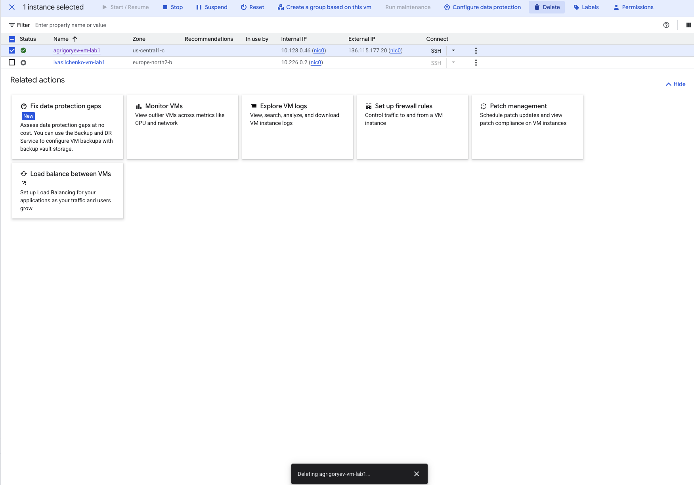

# Лабораторная работа №1

**University:** [ITMO University](https://itmo.ru/ru/)\
**Faculty:** [FICT](https://fict.itmo.ru)\
**Course:** [SA](https://itmo-ict-faculty.github.io/cloud-platforms-as-the-basis-of-technology-entrepreneurship/)\
**Year:** 2025\
**Group:** U4225\
**Author:** Григорьев Алексей\
**Lab:** Lab1\
**Date of create:** 25.11.2025\
**Date of finished:** 25.11.2025\

## Ход работы
1. Создание сервисного аккаунта с правами `Storage admin`

2. Создание виртуальной машины

3. Созданная машина

4. Копирование файлов с помощью `gsutil`

5. Изменение прав для сервисного аккаунта на Compute Viewer

6. Копирование файлов с новыми правами
Можно сделать вывод, что Compute Viewer не имеет доступа для записи файлов на сервер (создание/загрузка новых файлов)

7. Удаление созданных сервисов
