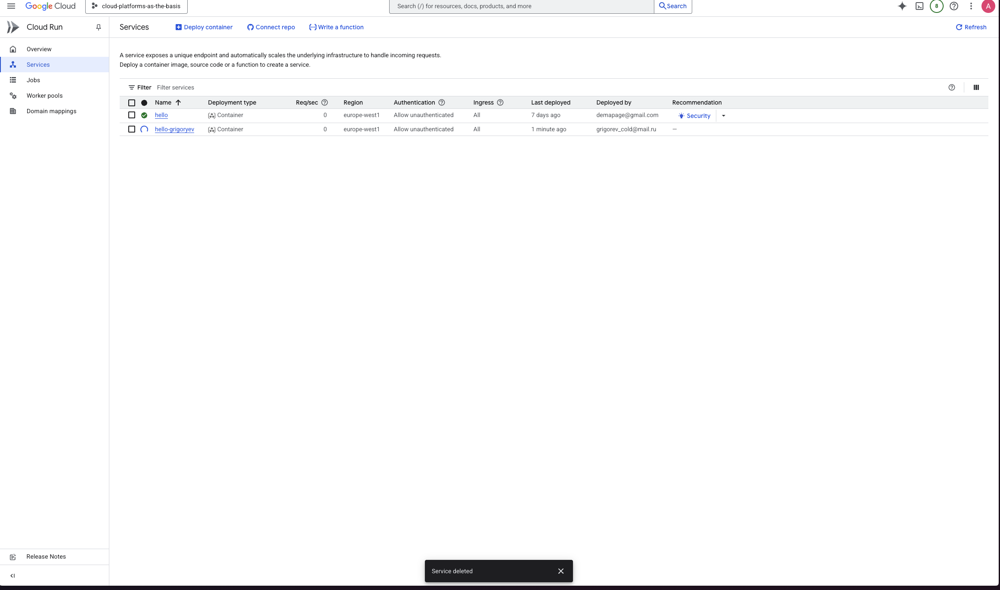

# Лабораторная работа №2

**University:** [ITMO University](https://itmo.ru/ru/)\
**Faculty:** [FICT](https://fict.itmo.ru)\
**Course:** [SA](https://itmo-ict-faculty.github.io/cloud-platforms-as-the-basis-of-technology-entrepreneurship/)\
**Year:** 2025\
**Group:** U4225\
**Author:** Григорьев Алексей\
**Lab:** Lab2\
**Date of create:** 25.11.2025\
**Date of finished:** 25.11.2025\

## Ход работы
1. Создание контейнера Hello

2. Проверка работы контейнера

3. Основные метрики

4. Логи контейнера

5. Деплой на новом порту; мы видим, что изменилась ревизия

6. Удаление созданных сервисов
