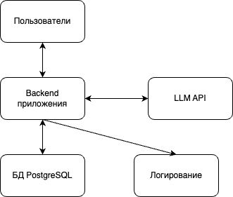
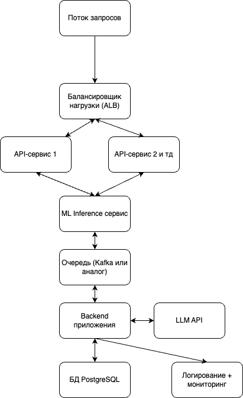

# Лабораторная работа №4

**University:** [ITMO University](https://itmo.ru/ru/)\
**Faculty:** [FICT](https://fict.itmo.ru)\
**Course:** [SA](https://itmo-ict-faculty.github.io/cloud-platforms-as-the-basis-of-technology-entrepreneurship/)\
**Year:** 2025\
**Group:** U4225\
**Author:** Григорьев Алексей\
**Lab:** Lab4\
**Date of create:** 01.12.2025\
**Date of finished:** 01.12.2025\

## Описание приложения

Рассматривается SaaS-сервис: **AI-ассистент службы поддержки** для компаний малого и среднего бизнеса.

Основные функции:

* приём обращений пользователей (из виджета/CRM/почты);
* классификация тикета (тип, приоритет, отдел);
* генерация черновика ответа через LLM по API;
* сохранение истории запросов и ответов.

Технологический стек (облачный, на примере AWS):

* backend: Python (FastAPI/Flask) в Docker;
* хранилище: PostgreSQL (Amazon RDS) + S3 для логов и датасетов;
* ML: собственный текстовый классификатор (отдельный сервис/потенциально отдельное обращение к LLM) + внешняя LLM по API (например, GPT-4.x mini);
* мониторинг: CloudWatch / простая связка метрик + логов.

---

## Этап 1 — MVP инфраструктура

**Задача:** быстро запустить рабочий прототип, минимизировать DevOps-нагрузку и расходы.

Основные компоненты:

* Один **EC2-инстанс**, внутри:

  * backend API (FastAPI/Flask);
  * сервис ML-инференса для классификации;
* **Внешний LLM по API** (поставщик языковой модели, запросы по HTTPS);
* **RDS PostgreSQL (db.t3.micro)** — хранение тикетов, пользователей, основных настроек;
* **S3** — хранение логов и датасетов для будущего обучения моделей;
* Базовое **логирование и мониторинг** (CloudWatch).

Ключевые свойства:

* всё максимально просто: один сервер + managed БД;
* модель вызывается как сервис по API — можно легко сменить провайдера;
* MVP сфокусирован на проверке ценности продукта, а не на сложной архитектуре.

**Примерные расходы (порядок):**

* EC2 + RDS + S3 + базовый трафик и логирование: ~**30–50 $/мес**;
* вызовы LLM по API при небольшой нагрузке: порядка **10 $/мес**.

**Схема:**

---

## Этап 2 — Архитектура для тестирования с партнёрами

**Задача:** отдать сервис нескольким внешним клиентам, выдерживать рост нагрузки и начать системно собирать данные.

Изменения по сравнению с MVP:

* Добавляется **балансировщик** (Application Load Balancer или Nginx):

  * несколько инстансов backend-сервиса за балансировщиком;
* Backend и ML-инференс **разносятся по сервисам**:

  * 2×EC2 для API,
  * 1×EC2 для ML-инференса;
* Между API и ML-сервисом появляется **очередь** (SQS или аналог):

  * выравнивание нагрузки,
  * возможность асинхронной обработки;
* **Увеличивается RDS** и объём S3;
* Добавляется более явный **мониторинг и алертинг**:

  * метрики по задержкам, ошибкам, количеству запросов;
* Появляется разделение окружений:

  * поток (MVP),
  * отдельный endpoint/сервис для партнёрского тестирования (staging-like).

**Примерные расходы:**

* несколько EC2-инстансов, усиленная RDS, очередь, ALB: ~**100–150 $/мес**;
* увеличение нагрузки по LLM (больше тикетов): ~**100 $/мес**.

**Схема:**

---

## Этап 3 — Продовая архитектура

**Задача:** обеспечить стабильный сервис с SLA, масштабируемость и отказоустойчивость при сотнях тысяч тикетов в месяц.

Ключевые изменения:

* Переход от отдельных EC2 к **кластеру контейнеров** (ECS или EKS):

  * 3 и более экземпляров API-сервиса с авто-масштабированием (скейлингом);
* Выделенный **GPU-инстанс или managed endpoint** для ML-инференса, возможность обновлять модель независимо от API;
* **Multi-AZ RDS PostgreSQL**:

  * отказоустойчивость базы данных;
  * регулярные бэкапы и репликация;
* **Увеличение S3**:

  * хранение логов, датасетов, артефактов моделей;
* Полноценный **наблюдаемый прод**:

  * метрики (задержки, коды ответов, загрузка CPU/GPU, очередь);
  * алерты (Slack/Telegram);
* Нормальная **VPC-схема**:

  * приватные подсети для приложений и базы;
  * доступ извне только через балансировщик;
* **CI/CD-пайплайн** для приложений и моделей:

  * автоматический деплой API;
  * выкатывание новых версий моделей через контейнеры.

**Примерные расходы:**

* кластер API + GPU-инференс + Multi-AZ RDS: ~**400–600 $/мес**;
* LLM по API при высокой нагрузке: до **300 $/мес** и выше (зависит от количества токенов);
* остальное (мониторинг, трафик, очереди): ещё ~**100–200 $/мес**.

В сумме продовый контур может лежать в диапазоне **~800–1000 $/мес**, при этом основная переменная часть — это токены LLM и реальная нагрузка.

**Схема:**

---

## Экономическая модель (по стадиям)

* **MVP:**

  * минимальный набор ресурсов, один сервер + RDS + S3;
  * итоговый чек: **~50–70 $/мес**.

* **Тестирование партнёрами:**

  * горизонтальное масштабирование API, отдельный ML-сервис, очередь и ALB;
  * итог: **~200–300 $/мес**.

* **Прод:**

  * кластер контейнеров, GPU-инстанс, Multi-AZ база, полноценная наблюдаемость;
  * итог: **~800–1000 $/мес** (сильно зависит от трафика и использования LLM).

